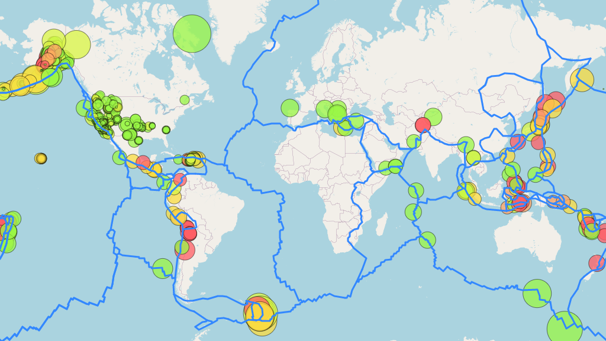

# Leaflet Challenge

In this challenge, data on world earthquakes for the past 7 days is pulled from the USGS website (United States Geological Survey) using their API and GeoJSON format.  

Leafletjs is used to map the earthquake locations with different color and size visuals to portray both the magnitude and depth of the earthquakes.  

Tectonic plates are overlayed on the map to see if there are correlations between where the earthquakes occur and the tectonic plate locations.  

